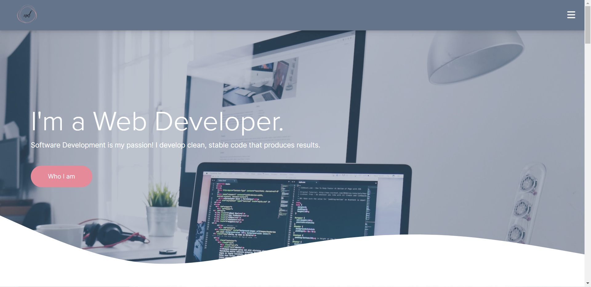
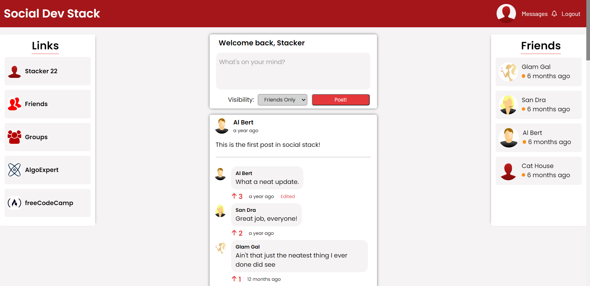
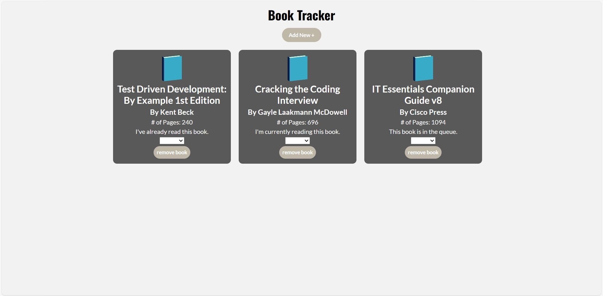

## Hi There! 👋

- 🌱 I'm currently learning Cloud Computing Technologies.
- 👯 I'm looking to contribute to open source projects.
- ⚡ Fun Fact: I enjoy knitting, two-stepping, yoga, and art.

#### DEVELOPMENT TOOLS & SKILLS

 
     
    
    
    
    
    
    
    
    
    
    
    
    <picture>
        <source srcset="https://cdn.jsdelivr.net/gh/devicons/devicon/icons/ubuntu/ubuntu-original.svg" media="(prefers-color-scheme: dark)" alt="ubuntu-logo">
        
    </picture>
   
   
       
      

#### DESIGN SOFTWARE

    
    
    
         

## Projects

### Portfolio Site

[Click here to see the live project](https://www.nadiadubell.dev/)

### Social Dev Stack

[Click here to see the live project](https://dev-social-stack.netlify.app/)

For test login info please send a LinkedIn request.

### Book Tracker

[Click here to see the live project](https://book-tracker-nd.netlify.app/)

<!-- ## GITHUB STATS

 -->
